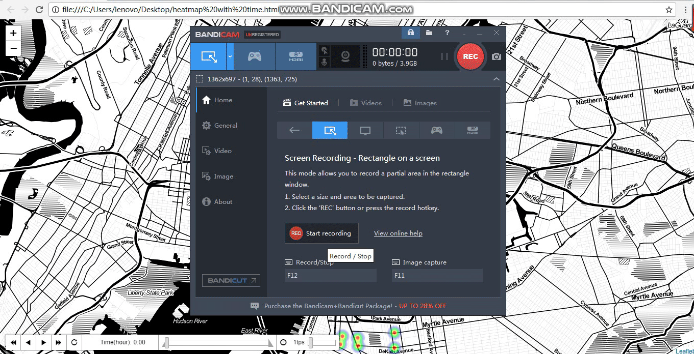

# Analysis on Citi Bike Trips in NYC
- Group name: Tools 666         

Brief Description
-------------------
The motivation of this project is to improve the location of bike stations by find the least used bike station and the busiest bike station, and to find out the most used bikes and least used bikes to better reallocate them for efficiency. 

By plotting data, we can visualize the distribution of bike stations and traffic density. With multiple regression models, factors that affect trip duration are investigated and best model is selected.

Package List
-----------------------
To install numpy package:
- !pip install numpy
- import numpy as np

Install pandas package to work on data frame:
- !pip install pandas
- import pandas as np

Use matplotlib and seaborn packages for plotting:
- !pip install matplotlib
- import matplotlib.pyplot as plt
- !pip install seaborn
- import seaborn as sns

We need json and geojsonio packags to do geospacial plotting:
- !pip install json
- import json 
- !pip install geojsonio
- import geojsonio

To deal with date objects:
- !pip install datetime
- import datetime

folium is installed to draw heat map:
- !pip install folium
- import folium

To cunstruct network of the bikes, we need to install networkx:
- !pip install network
- import network as nx

To analyze centrality of stations, we need import two functions and collections package
- from networkx.algorithms import closeness_centrality
- from networkx.algorithms import communicability
- !pip install collections 
- import collections

For machine learning part, package sklearn is used:
- !pip install sklearn 
- import sklearn

To check the statistical results of regressions, install:
- !pip statsmodels.api 
- import statsmodels.api as sm

To keep the plots showing inline of the Jupyter Notebook:
- %matplotlib inline

Methods Used
------------
- **Data Visualization**
  - **Histogram**, **bar chart**, **line chart** on the relationship between time and distance, and give rush hour speed on a day.
  - **Dynamic heat map** to provide a dynamic view of the frequency of bike station using on a weekday per hour. 
  - **GeoJSON** to provide detailed information about a given bike station on the map
- **Predictive Modeling**
  - **Multiple linear regression**, **polynomial regression** to find out factors affecting trip duration and give a prediction of trip duration. Factors include distance, latitude and longitude of start and end bike station, etc. 
- **Network** shows number of trips and average duration of pickups and dropoffs on each edge. 

Preview of important results 
------------------
- **Dynamic heat map** (for complete dynamic heat map, please download the html file in the repo!): 
  
- **Bar charts** show the different time schedule of subscriber (mainly local residents with annual pass, figure 1) and customer(mainly travells, figure 2) on weekdays.
  
  
- **Line charts** show the bike trip flows going into Manhattan and leaving Manhattan on weekdays (figure 1) and weekends (figure 2). On weekends, the bike ride flows going into Manhattan and leaving Manhattan both peak in the afternoon. 
 
 
 
 - Highly used and rarely used bikes are found by locating their ids. Some bikes travel more than 1000 miles in a month and some bikes are not used. Highly used bikes require maintainance while those travel very short distances need to be checked whether they are functional. 

- The top 10% highly used bycicles often park in these stations:
  - Pershing Square North
  - Broadway & E 22 St
  - E 17 St & Broadway
  - Central Park S & 6 Ave
  - W 21 St & 6 Ave
  
- The bottom 10% rarely used bycicles often park in these stations:
  - Hanson Pl & Ashland Pl
  - DeKalb Ave & Hudson Ave
  - Grand Army Plaza & Central Park S
  - Broadway & E 22 St
  - 3 St & 3 Ave
 
 - Bycicles can be relocated between popular stations and unpopular stations. Funtionaliteis need to be checked.
  - Especially for Broadway & E 22 St, people have bycicles preference at that station. This might due to some bicycles are not functional.

Getting Started
------------------
1. Clone this repo
2. Download raw data [here](https://s3.amazonaws.com/tripdata/201810-citibike-tripdata.csv.zip) (the data is too big to upload on github)
3. Data processing - notebook in this repo

Contributors
------------------
|Name     |  
|---------|
|[Yichang Chen](https://github.com/yichangchen1030)| 
|[Rui Han](https://github.com/harry0107100) | 
|[Jiahe Hou](https://github.com/jiahehousherry) | 
|[Dingran Lu](https://github.com/LDRRRR) | 
